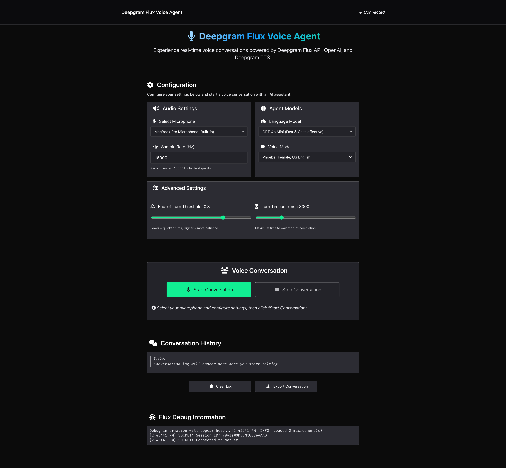

# Deepgram Flux Voice Agent

A real-time voice conversation application powered by Deepgram Flux API, OpenAI, and Deepgram TTS. Features a beautiful web interface built with Deepgram's design system.

FLUX is Deepgram's breakthrough conversational AI model that understands **turn-taking dynamics** - not just transcribing words, but knowing when to listen, when to think, and when to speak. Perfect for building voice agents and interactive applications. Learn more about Flux by checking out our [Documentation](https://developers.deepgram.com/docs/stt/getting-started)


## Demo Browser Support

This demo will run in Chrome and Safari browsers only. No Firefox support.

## Using the Deepgram Python SDK

This demo's main branch doesn't use the Deepgram Python SDK. If you want to see an example of this demo using the SDK, check out the [feat/sdk-integration](https://github.com/deepgram-devs/deepgram-demos-flux-agent/tree/feat/sdk-integration) branch.

```bash
git checkout feat/sdk-integration
```

## Features

- **Real-time voice conversations** with AI assistant
- **Microphone selection** from available devices
- **Configurable AI models** (OpenAI LLM and Deepgram TTS)
- **Advanced settings** for turn detection thresholds
- **Live conversation display** with real-time transcripts
- **A simple UI** using Deepgram design system
- **Debug logging** for development and troubleshooting
- **Conversation export** functionality

## Components

- **Flask + SocketIO**: Web server and real-time communication
- **Deepgram Flux**: Real-time speech-to-text with turn detection
- **OpenAI API**: Language model for generating responses
- **Deepgram TTS**: Text-to-speech for agent voice
- **Web Audio API**: Browser audio capture and playback

## Prerequisites

- Python 3.8 or higher
- Microphone access
- Valid API keys for:
  - Deepgram API (set as DEEPGRAM_API_KEY environment variable)
  - OpenAI API (set as OPENAI_API_KEY environment variable)

## Setup

### 1. Clone and Install

```bash
git clone git@github.com:deepgram-devs/deepgram-flux-agent-demo.git
cd flux-agent-demo
pip install -r requirements.txt
```

### 2. Set Environment Variables

```bash
export DEEPGRAM_API_KEY="your_deepgram_api_key_here"
export OPENAI_API_KEY="your_openai_api_key_here"
```

### 4. Run the Application

```bash
python app.py
```

### 5. Open in Browser

Open your web browser and navigate to: `http://localhost:3000/flux-agent`

 **Note**: The app serves under `/flux-agent` in both local development and production for consistency.

## Configuration Options

The application provides configuration options through the web interface:

### Audio Settings
- **Microphone Selection**: Choose from available audio input devices
- **Sample Rate**: Audio quality (default: 16000 Hz, recommended for Flux)
- **Echo Cancellation**: Automatically enabled to prevent the agent from hearing itself
- **Noise Suppression**: Built-in noise reduction for cleaner audio input
- **Auto Gain Control**: Automatic volume level management for consistent audio


```js
// Get microphone stream with echo cancellation enabled
      const constraints = {
        audio: {
          deviceId: this.selectedDeviceId ? { exact: this.selectedDeviceId } : undefined,
          channelCount: 1,
          sampleRate: this.config.sample_rate,
          // can be set to false as needed.
          echoCancellation: true,  // Enable echo cancellation to prevent feedback
          noiseSuppression: true,  // Enable noise suppression for cleaner audio
          autoGainControl: true    // Enable auto gain control for consistent levels
        }
      };
```

### AI Models
- **Language Model**: Choose from OpenAI models (gpt-4o-mini, gpt-4o, gpt-3.5-turbo)
- **Voice Model**: Select Deepgram TTS voice.

### Advanced Settings
- **End-of-Turn Threshold**: Confidence level for finalizing turn completion (0.5-0.9)
- **Turn Timeout**: Maximum wait time for turn completion (1000-10000ms)

## Default Configuration

The application comes with optimized defaults:

```python
SAMPLE_RATE = 16000
OPENAI_LLM_MODEL = "gpt-4o-mini"
DEEPGRAM_TTS_MODEL = "aura-2-phoebe-en"
EOT_THRESHOLD = 0.8
EOT_TIMEOUT_MS = 3000
```
## How to Use

1. **Configure Settings**: Select your microphone and adjust AI model settings
2. **Start Conversation**: Click "Start Conversation" to begin
3. **Speak Naturally**: The app will transcribe your speech in real-time
4. **Listen to Responses**: The AI assistant will respond with natural speech
5. **Monitor Progress**: Watch the conversation log and debug information
6. **Stop When Done**: Click "Stop Conversation" to end the session

## 🚀 Deployment

This demo is containerized and ready for deployment to any platform that supports Docker.

### Deployment Files Included
- **`Dockerfile`**: Python Flask container setup
- **`fly.toml`**: Fly.io configuration (can be adapted for other platforms)
- **`.dockerignore`**: Optimized for Python projects

### Environment Variables
- **`DEEPGRAM_API_KEY`**: Your Deepgram API key (required)
- **`OPENAI_API_KEY`**: Your OpenAI API key (required)

### Production Notes
- The app binds to `0.0.0.0:3000` for external access
- Debug mode is enabled by default (set `DEBUG = False` in config.py for production)
- All static assets are served directly by the Flask application

## Troubleshooting

### Common Issues

**1. Microphone Access Denied**
- Ensure your browser has microphone permissions
- Check system privacy settings
- Try refreshing the page and allowing microphone access

**2. API Key Errors**
- Verify your Deepgram API key is valid and has credits
- Ensure your OpenAI API key is active
- Make sure environment variables are properly exported in your shell

**3. Connection Issues**
- Ensure port 3000 is available
- Check firewall settings
- Try restarting the application

**4. Audio Playback Issues**
- Check browser audio permissions
- Ensure speakers/headphones are connected
- Try a different browser if issues persist

**5. Echo/Feedback Problems**
- **Echo cancellation is enabled by default** to prevent the agent from hearing itself
- If still experiencing feedback, try using headphones or adjusting speaker volume
- Check that your browser supports echo cancellation (Chrome and Safari work best)
- For advanced users: echo cancellation can be toggled in `voice-agent.js`

### Debug Information

The application provides comprehensive debug logging:
- **SOCKET**: WebSocket connection events
- **FLUX**: Deepgram Flux WebSocket events
- **USER**: User speech detection and transcription
- **AGENT**: AI response generation and TTS
- **AUDIO**: Audio capture and playback information
- **CONFIG**: Configuration updates
- **ERROR**: Error messages and stack traces

### Performance Tips

1. **Audio Quality Optimization**:
   - **Echo cancellation is automatically enabled** to prevent the agent from hearing itself
   - **Use headphones for best results**, though not strictly required due to echo cancellation
   - **Noise suppression and auto gain control** are enabled for cleaner, more consistent audio
   - These settings can be adjusted in the code (`voice-agent.js`) if needed for specific environments

2. **Conversation Flow**:
   - **Adjust thresholds** based on your speaking style
   - **Monitor debug logs** to optimize settings
   - **Choose appropriate models** based on speed vs quality needs

3. **Troubleshooting Audio Issues**:
   - If experiencing feedback, check that echo cancellation is enabled (default: true)
   - For noisy environments, ensure noise suppression is active
   - Audio processing settings are configured in `getUserMedia` constraints


## 📊 What You'll See Working

When everything is working correctly, you should see:

**🖥️ Browser Interface:**
- Audio, Agent, Model and Flux settings
- Real-time conversation history as you speak
- FLUX Events log showing JSON responses from the API
- Audio output from Agent

**💻 Server Logs:**
- Connection success to Deepgram FLUX API
- Connection success to Open AI Chat completions API
- Connection success to Depgram TTS completions API
- Audio chunks being forwarded (1280 bytes each)
- FLUX responses with TurnInfo events
- Message type debugging information
- Initial Config settings and changes
- Agent & User interactions



## Getting Help

We'd love to hear from you! If you have questions:

- [Join the Deepgram Github Discussions Community](https://github.com/orgs/deepgram/discussions)
- [Join the Deepgram Discord Community](https://discord.gg/xWRaCDBtW4)

[license]: LICENSE.txt

